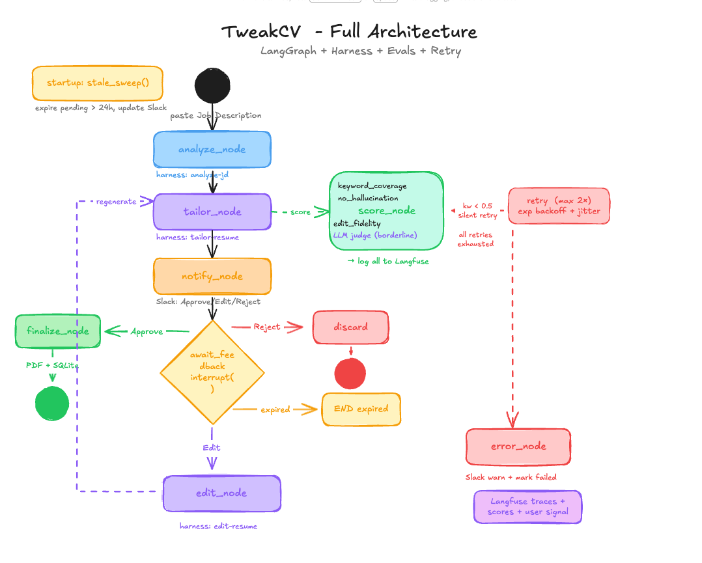

# TweakCV

Paste a job description → AI tailors your resume → review in Slack → PDF saved locally.

## How it works



**Score gates** run on every version before Slack is notified:
- `keyword_coverage` — % of JD keywords present (retry if < 0.5)
- `no_hallucination` — no invented companies, dates, or skills
- `edit_fidelity` — did the edit apply what was asked? (edit loop only)
- `quality` — LLM judge, fires only when heuristics are borderline (0.4–0.6)

All scores + user Approve/Reject are logged to Langfuse.

## Stack

| | |
|---|---|
| Workflow | LangGraph (HITL, SqliteSaver checkpointer) |
| AI | Gemini 2.0/2.5 Flash (Google AI Studio free tier) |
| Notifications | Slack Bolt + FastAPI webhook |
| PDF | WeasyPrint |
| Storage | SQLite + SQLAlchemy |
| Observability | Langfuse Hobby (free) |
| Runtime | Docker + Docker Compose |

## Prerequisites

- [Docker Desktop](https://www.docker.com/products/docker-desktop/)
- [uv](https://docs.astral.sh/uv/getting-started/installation/) — `brew install uv`
- [ngrok](docs/ngrok-setup.md) — for Slack webhooks

## Setup

**1. Environment**
```bash
cp .env.example .env
```
Fill in all values — see [docs/env-setup.md](docs/env-setup.md) for where to get each one.

**2. Slack app**
Follow [docs/slack-setup.md](docs/slack-setup.md) to create the app and get your tokens.

**3. ngrok**
```bash
ngrok http --url=<your-static-domain> 3000
```
See [docs/ngrok-setup.md](docs/ngrok-setup.md) for one-time static domain setup.

**4. Seed prompts to Langfuse** *(optional — app works without this)*
```bash
uv run python -m tweakcv.seed_prompts
```

## Running

```bash
docker compose up --build
```

That's it. Once the container is up, **paste a job description into the Slack channel** — the bot picks it up and posts a tailored resume with Approve / Edit / Reject buttons. Approved resumes are saved as PDFs in `output/`.

## Testing

**Unit tests** (no network, mocked LLM/Slack/Langfuse):
```bash
uv run pytest
```

**Eval runner** — checks prompt quality against labelled examples:
```bash
uv run python evals/run_evals.py                   # heuristic checks only — zero API calls
uv run python evals/run_evals.py --threshold 0.9   # stricter pass rate
uv run python evals/run_evals.py --regen           # re-call LLM, update cache, then check
```

### How the eval cache works

The eval runner separates **LLM generation** from **checking**:

- `evals/cache/{id}.json` stores the tailored resume output per example.
- Without `--regen`: loads from cache and runs all heuristic checks locally — instant, no API quota used.
- With `--regen`: calls the real LLM for every example, saves fresh outputs to cache, then checks.

**Rule: run `--regen` once every time you edit `harness.json`.** After that, normal runs are free.

Checks per example:

| Check | Pass/fail gate | Description |
|---|---|---|
| `keyword_coverage` | ✅ | ≥ threshold% of JD keywords present |
| `no_hallucination` | ✅ | No invented companies or institutions |
| `no_markdown` | ✅ | No `**bold**` or `_italic_` in output |
| `first_person_summary` | ✅ | Summary uses "I", not candidate's name |
| `date_preservation` | ✅ | Dates match base resume exactly |
| `skills_are_tools` | ✅ | No generic JD phrases in skills list |
| `quality_judge` | ℹ️ informational | LLM holistic score 0–1 (from cache) |

At least 80% of examples must pass all gate checks for the suite to be green.

### Separate API key for evals

To avoid eval runs consuming your production Gemini quota, add a second key to `.env`:
```
GEMINI_API_KEY_EVAL=AIza...your-second-key
```
Both keys have their own free-tier quota (20 req/day). `--regen` uses the eval key automatically if set.

### Sync prompts and dataset to Langfuse

```bash
uv run python evals/sync_langfuse.py            # sync prompts + dataset
uv run python evals/sync_langfuse.py --prompts  # prompts only
uv run python evals/sync_langfuse.py --dataset  # dataset only
```

## Docs

- [env-setup.md](docs/env-setup.md) — all environment variables
- [slack-setup.md](docs/slack-setup.md) — Slack app configuration
- [ngrok-setup.md](docs/ngrok-setup.md) — ngrok tunnel setup
- [PRD](docs/PRD.md) — product requirements
- [TRD](docs/TRD.md) — technical requirements & architecture
